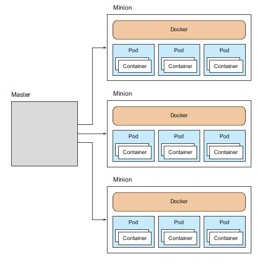
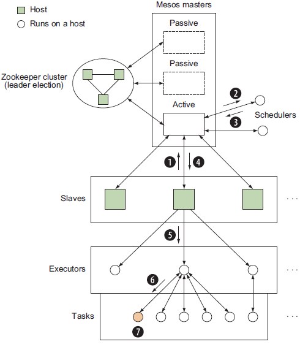
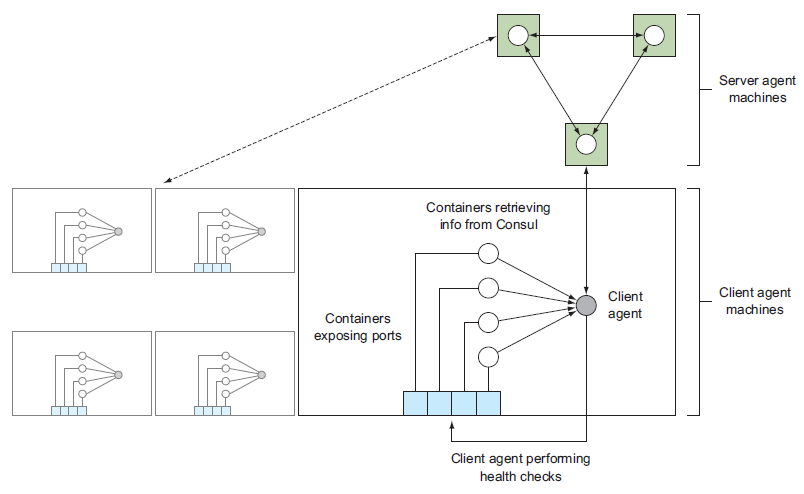

Some advanced topics on 《Manning Docker in Practice》

<!-- more -->

Docker Network
================

### docker 虚拟网络

Docker 的虚拟网络配置如 

- Host 的 eth0 网络连接外网
- Host 的 docker0 网络是一个路由，让 docker 虚拟网络中的容器组成一个局域网
- Host 还有一个 loopback 网络 lo，对应 127.0.0.1
- 当容器创建，Docker daemon 会生成一对儿 veth 接口，一个布置在 Host 的 docker0 bridge 上，一个布置在容器的 eth0 上，互相通讯
- 容器还可以通过 --net=host 的方式启动，此时共享 Host 的网络设置，而不会创建虚拟网络

Host 宿主机上执行命令
```
$ ip route
default via 10.88.147.254 dev eth0         <-- 路由
10.88.147.0/24 dev eth0  proto kernel  scope link  src 10.88.147.128    <-- 网络和 Host 的外网 ip
169.254.0.0/16 dev eth0  scope link  metric 1003
172.17.0.0/16 dev docker0  proto kernel  scope link  src 172.17.0.1     <-- docker0 虚拟网络和 Host 在虚拟网络中的 ip
172.18.0.0/16 dev br-79f7b6f4f4e4  proto kernel  scope link  src 172.18.0.1    <-- docker network 启动的另一个虚拟网络

$ ip addr
1: lo: <LOOPBACK,UP,LOWER_UP> mtu 65536 qdisc noqueue state UNKNOWN
   inet 127.0.0.1/8 scope host lo        <-- lo 网络 ip: 127.0.0.1
2: eth0: <BROADCAST,MULTICAST,UP,LOWER_UP> mtu 1500 qdisc pfifo_fast state UP qlen 1000
   inet 10.88.147.128/24 brd 10.88.147.255 scope global eth1    <-- Host 外网 ip: 10.88.147.128
3: docker0: <BROADCAST,MULTICAST,UP,LOWER_UP> mtu 1500 qdisc noqueue state UP
   inet 172.17.0.1/16 scope global docker0                      <-- Host 在 Docker0 虚拟网络上的 ip: 172.17.0.1
4: br-79f7b6f4f4e4: <NO-CARRIER,BROADCAST,MULTICAST,UP> mtu 1500 qdisc noqueue state DOWN
   inet 172.18.0.1/16 scope global br-79f7b6f4f4e4              <-- Host 在另一个自定义虚拟网络上的 ip: 172.18.0.1
............
```

容器内执行命令
```
# ip addr
1: lo: <LOOPBACK,UP,LOWER_UP> mtu 65536 qdisc noqueue state UNKNOWN group default
   inet 127.0.0.1/8 scope host lo
6: eth0@if7: <BROADCAST,MULTICAST,UP,LOWER_UP> mtu 1500 qdisc noqueue state UP group default
   inet 172.17.0.2/16 scope global eth0              <-- 容器在 Docker 虚拟网络中的 ip

# ip route
default via 172.17.0.1 dev eth0          <-- 容器在 Docker 虚拟网络中的路由，看到就是宿主机在虚拟网络中的 ip
172.17.0.0/16 dev eth0  proto kernel  scope link  src 172.17.0.2    <-- 虚拟网络和容器在其中的 ip

# route -n
Kernel IP routing table
Destination     Gateway         Genmask         Flags Metric Ref    Use Iface
0.0.0.0         172.17.0.1      0.0.0.0         UG    0      0        0 eth0    <-- 网关就是宿主机在虚拟网络中的 ip
172.17.0.0      0.0.0.0         255.255.0.0     U     0      0        0 eth0
```

### 使用 Resolvable 搭建 DNS 实现容器间互联

前面知道，可以通过 docker run --link 或者 docker-compose 中的 link 来实现容器间访问，其本质是运行时修改 /etc/hosts

还有更好的方法么？我们知道容器其实运行在 Host 的 docker0 bridge 提供的虚拟网络上，可以在虚拟网络上创建一个 DNS

[Resolvable](https://github.com/gliderlabs/resolvable/) 可以读取容器信息，并提供 name to ip 的 DNS 服务

首先，在宿主机执行下面命令，获取 Host 的 docker0 bridge ip 和默认 DNS 配置
```
$ ip addr | grep 'inet.*docker0'
inet 172.17.42.1/16 scope global docker0
$ docker run --rm ubuntu:14.04.2 cat /etc/resolv.conf | grep nameserver
nameserver 8.8.8.8
nameserver 8.8.4.4
```

启动 Resolvable 容器提供 DNS 服务
```
$ DNSARGS="--dns 8.8.8.8 --dns 8.8.4.4"
$ PORTARGS="-p 172.17.42.1:53:53/udp"
$ VOLARGS="-v /var/run/docker.sock:/tmp/docker.sock"
$ docker run -d --name res -h resolvable $DNSARGS $PORTARGS $VOLARGS \
gliderlabs/resolvable:master
```
一些要点如下：

- --dns 选项将在容器内生成 /etc/resolv.conf 作为后备 DNS，当 Resolvable 服务无法识别给定的 name 时，就把请求转发给 /etc/resolv.conf 中的地址；这个选项在这里完全可以不写，因为选项的值和 Host 中的 /etc/resolv.conf 是完全一致的，而容器会默认继承 Host 中的 /etc/resolv.conf
- - -p 选项指定了端口转发，也就是说，指向 Host docker0 bridge 地址 53 端口的请求会转发到容器的 53 端口，并采用 udp 协议；这个端口用于监听 Resolvable 的 DNS 请求，将由 Resolvable 容器来提供服务
- - -v 选项把 docker socket 映射到容器中，使得 Resolvable 容器可以访问 Host 的 Docker Daemon
- - --name 和 -h 命令分别指定容器的 name 和 hostname；当 Resolvable 的 DNS 服务生效，Docker 虚拟网络中容器的 \<name\>.docker 和 \<hostname\> 都可以用来查询容器的 ip 地址

可以使用 dig (dnsutils on Ubuntu | bind-utils on CentOS) 来 check Resolvable 是否生效
```
# 向 Docker bridge0 也即 Host 的内网地址发请求，进而转发到 Resolvable 的 53 端口
$ dig +short @172.17.42.1 res.docker
172.17.0.22
$ dig +short @172.17.42.1 resolvable
172.17.0.22

$ docker run -it --dns 172.17.42.1 ubuntu:14.04.2 bash     # 启动新容器，dns 指向 docker0，其实会转发到 Resolvable
/# ping -q -c1 res.docker               # 看到，没有使用 link，Host 网络中的容器仍然可以相互可见和访问
...........
1 packets transmitted, 1 received, 0% packet loss, time 0ms
...........
/# ping -q -c1 www.google.com           # 这里将会使用 /etc/resolv.conf 中的地址
...........
1 packets transmitted, 1 received, 0% packet loss, time 0ms
...........
```

最后，配置好 Resolvable 之后，可以通过配置 Docker Daemon 选项的方法，配置 --bip=172.17.42.1/16 --dns=172.17.42.1

这样，之后再次 docker run 启动容器时，自动会生效上面两个选项，其中

- --bip=172.17.42.1/16 用于固定住 docker bridge0 网络路由的 ip，这样 Resolvable 启动中硬编码的 172.17.42.1 就不会失效
- - --dns=172.17.42.1 指定新启动的容器 dns 指向 172.17.42.1，这样 DNS 请求就会通过端口映射转发到 Resolvable 的 53 端口


### 使用 Weave 实现跨宿主机的容器间通讯

单宿主机上的容器都在 docker0 bridge 局域网中，上一节使用 Resolvable 在这个局域网中创建 DNS 服务，实现容器间相互通讯。

多宿主机上的容器显然各自在其宿主机的局域网中，无法互联，也无法使用 Resolvable，那么有办法实现相互通讯么？

答案是肯定的，使用 Weave 搭建一条虚拟局域网(Weave network)，并实现容器间使用 ip 相互通讯。

[Weave](https://github.com/zettio/weave) 是一个二进制文件，要在每个需要互联的宿主机上安装一份
```
$ sudo wget -O /usr/local/bin/weave https://github.com/zettio/weave/releases/download/latest_release/weave
$ sudo chmod +x /usr/local/bin/weave
```

下面，比如要让 host1 & host2 两个宿主机的容器间互联，这两个宿主机本身必须是可以通过 ip 互联的

在宿主机 host1 上执行
```
host1$ curl http://ip-addr.es       # 通过 curl ip-addr.es 来返回宿主机的 ip 地址
1.2.3.4
host1$ sudo weave launch            # 使用 sudo 启动 Weave 服务
host1$ C=$(sudo weave run 10.0.1.1/24 -t -i ubuntu)      # 通过 weave 而不是通过 docker run 来启动容器，并设置虚拟局域网上容器的 ip
```

在宿主机 host2 上执行
```
host2$ curl http://ip-addr.es       # 同样，获取 host2 的 ip
1.2.3.5
host2# sudo weave launch 1.2.3.4    # sudo 启动 Weave 并指定 host1 ip，以 attach 到 host1 的 Weave 服务所创建的虚拟局域网中
host2# C=$(sudo weave run 10.0.1.2/24 -t -i ubuntu)      # 同样通过 weave 启动容器，并设置虚拟局域网内容器的 ip
```

OK，现在两个容器可以相互通讯了，比如在 host1 上，
```
host1# docker attach $C
root@28841bd02eff:/# ping -c 1 -q 10.0.1.2
PING 10.0.1.2 (10.0.1.2): 48 data bytes
--- 10.0.1.2 ping statistics ---
1 packets transmitted, 1 packets received, 0% packet loss    # 成功 ping 到 host2 上的容器
```


Docker Orchestration
=======================

### 单宿主机上使用 Systemd 进行编排

Docker 本身提供 docker-compose 工具，可以定义单宿主机上容器的配置以及协调容器间的依赖关系。这个工具在 Docker 容器级别上非常好用，但是无法对宿主机非 Docker 领域的资源做管理。

Systemd 有些类似 Supervisord，是对宿主机服务级别的管理工具，可以在更高的层面上，对容器进行管理和编排。下面以 SQLite + socat 代理为例，看看 systemd 和 docker-compose 的区别

Systemd 使用 ini 格式的配置文件，下面先看看 SQLite server 容器的配置：/etc/systemd/system/sqliteserver.service
```
[Unit]
Description=SQLite Docker Server
After=docker.service        # 依赖 docker 服务
Requires=docker.service

[Service]
Restart=always              # 自动重启
ExecStartPre=-/bin/touch /tmp/sqlitedbs/test      # 启动前准备好宿主机上的数据库目录
ExecStartPre=-/bin/touch /tmp/sqlitedbs/live
ExecStartPre=/bin/bash -c '/usr/bin/docker kill sqliteserver || /bin/true'    # 启动前先清理历史服务
ExecStartPre=/bin/bash -c '/usr/bin/docker rm -f sqliteserver || /bin/true'
ExecStartPre=/usr/bin/docker pull dockerinpractice/docker-compose-sqlite      # 启动前先 pull 镜像
ExecStart=/usr/bin/docker run --name sqliteserver \         # 启动命令，就是一条 docker run
-v /tmp/sqlitedbs/test:/opt/sqlite/db \
dockerinpractice/docker-compose-sqlite /bin/bash -c \
'socat TCP-L:12345,fork,reuseaddr \
EXEC:"sqlite3 /opt/sqlite/db",pty'
ExecStop=/usr/bin/docker rm -f sqliteserver                 # 服务终止命令，删除容器

[Install]
WantedBy=multi-user.target                        # 系统启动后的服务自动运行命令，后面会看到这条命令如何生效
```

然后是 socat 代理容器的配置：/etc/systemd/system/sqliteproxy.service
```
[Unit]
Description=SQLite Docker Proxy
After=sqliteserver.service           # 依赖 sqliteserver 服务，故此间接依赖 docker 服务
Requires=sqliteserver.service

[Service]
Restart=always                       # 自动重启
ExecStartPre=/bin/bash -c '/usr/bin/docker kill sqliteproxy || /bin/true'    # 类似的启动前清理历史及 pull 镜像
ExecStartPre=/bin/bash -c '/usr/bin/docker rm -f sqliteproxy || /bin/true'
ExecStartPre=/usr/bin/docker pull dockerinpractice/docker-compose-sqlite
ExecStart=/usr/bin/docker run --name sqliteproxy \                           # 启动命令
-p 12346:12346 --link sqliteserver:sqliteserver \
dockerinpractice/docker-compose-sqlite /bin/bash \
-c 'socat TCP-L:12346,fork,reuseaddr TCP:sqliteserver:12345'
ExecStop=/usr/bin/docker rm -f sqliteproxy                                   # 服务终止清理命令

[Install]
WantedBy=multi-user.target                                                   # 系统启动后服务自动运行设置
```

接下来服务 enable 以及启动后自动运行的配置
```
$ sudo systemctl enable /etc/systemd/system/sqliteserver.service
ln -s '/etc/systemd/system/sqliteserver.service' \
'/etc/systemd/system/multi-user.target.wants/sqliteserver.service'

$ sudo systemctl enable /etc/systemd/system/sqliteproxy.service
ln -s '/etc/systemd/system/sqliteproxy.service' \
'/etc/systemd/system/multi-user.target.wants/sqliteproxy.service'
```
把容器服务 link 到 /etc/systemd/system/multi-user.target.wants/，系统重启进入 multi-user stage 时就会自动启动服务

运行服务
```
$ sudo systemctl start sqliteproxy
```
由于 Systemd 配置了依赖关系，故此这里只要运行 sqliteproxy，那么它所依赖的服务都会自动启动

到这里，我们看看 Systemd 和 docker-compose，它们的共同点是都定义了容器间的依赖关系，但是他们的区别是显而易见的

- docker-compose 着眼于容器自身的配置，比如 link、volume、entrypoint 等等；而这些对于 systemd 来说，只是一条启动命令而已，由使用者自己搞定
- Systemd 则着眼于容器和宿主机之间的联系，比如准备运行环境、启动前中后期宿主所要担负的职责等，是从宿主的角度来编排和配置容器的运行

这样看来，我们可以在 systemd 的启动命令部分，直接使用 docker-compose，这样就不需要定义两个服务了，只要一个服务启动两个容器即可

### 多宿主机上使用 Helios 手动 Docker 编排

Helios 是 Spotify 公司开发的 Docker 多宿主编排工具，以手动的方式控制容器具体部署到哪个宿主。出于简单考虑，本部分的例子仍然在单宿主机上运行，不过会指出如何扩展到多宿主的情况。

Helios 的架构如 

具体来说，Helios 由 Masters / ZooKeeper / Agents 组成；Masters 本身也可以是集群，避免单点故障造成可用性损失。Masters 和 Agents 都注册在 Zookeeper 上，由 ZooKeeper 维护集群节点以及部署任务信息；用户向 Master 发送部署 jobs，然后手动指定 jobs 所部属的 Agents 节点。

部署ZooKeeper，注意 ZooKeeper 本身也可以是集群，而本例中只是部署在一个节点而已
```
$ docker run --name zookeeper -d jplock/zookeeper:3.4.6
$ docker inspect -f '{{.NetworkSettings.IPAddress}}' zookeeper
172.17.0.9                 # 记住 ZooKeeper 所部署的位置
```

部署 Helios Master，这里部署在同一个宿主的另一个容器上
```
$ IMG=dockerinpractice/docker-helios
$ docker run -d --name hmaster $IMG helios-master --zk 172.17.0.9         # helios-master 命令，指定 ZooKeeper 的位置
$ docker inspect -f '{{.NetworkSettings.IPAddress}}' hmaster
172.17.0.11                    # 记住 Master 的位置
```

通过 ZooKeeper Client 查看 ZK 集群中的配置信息
```
$ docker exec -it zookeeper bin/zkCli.sh
[zk: localhost:2181(CONNECTED) 0] ls /
[history, config, status, zookeeper]             # 看到，除了默认的 zookeeper 目录之外，Helios Master 创建了另外 3 个目录
[zk: localhost:2181(CONNECTED) 2] ls /status/masters
[896bc963d899]                                   # /status/masters 记录了 Master 的容器 id
[zk: localhost:2181(CONNECTED) 3] ls /status/hosts
[]                                               # 还没有 Agent Hosts
```

部署 Helios Agents，同样部署在同一个宿主上
```
$ docker run -v /var/run/docker.sock:/var/run/docker.sock -d --name hagent \       # 由于 Agents 要负责启动容器，故此，必须能调用 Docker
dockerinpractice/docker-helios helios-agent --zk 172.17.0.9                        # 同样要指定 ZooKeeper 位置，由 ZK 统一管理
$ docker inspect -f '{{.NetworkSettings.IPAddress}}' hagent
172.17.0.12                                                                        # 记住 Agent 的位置
```

再次查看 ZK 中的配置
```
[zk: localhost:2181(CONNECTED) 4] ls /status/hosts
[5a4abcb27107]                       # 已经有了 Agent Host
[zk: localhost:2181(CONNECTED) 5] ls /status/hosts/5a4abcb27107
[agentinfo, jobs, environment, hostinfo, up]       # 这个Host 也配置了一些必要的目录
[zk: localhost:2181(CONNECTED) 6] get /status/hosts/5a4abcb27107/agentinfo
{"inputArguments":["-Dcom.sun.management.jmxremote.port=9203", [...]
[...]
```

Helios 环境搭建完毕！下面要做的是，如何使用 Helios 集群来部署和编排容器了！

首先，创建 Helios Client 的快捷方式
```
$ alias helios="docker run -i --rm dockerinpractice/docker-helios \      # 命令会启动 Helios 容器，执行 helios 命令；命令完成后自动退出
helios -z http://172.17.0.11:5801"                                       # 命令参数需要制定 Helios Masters 的位置
```

然后创建部署任务，注意这里不指定部署的位置，所做的只是定义一下任务
```
$ helios create -p nc=8080:8080 netcat:v1 ubuntu:14.04.2 -- \    # 任务名字 netcat:v1，指定镜像，分配端口
sh -c 'echo hello | nc -l 8080'                                  # 容器启动后执行的命令
$ helios jobs
JOB ID NAME VERSION HOSTS COMMAND ENVIRONMENT
netcat:v1:2067d43 netcat v1 0 sh -c "echo hello | nc -l 8080"
```

开始部署
```
$ helios deploy netcat:v1 5a4abcb27107           # 指定 Agent Host 的容器 ID，表示在该 Host 上部署 netcat 任务；是手动的静态部署！
$ helios status
JOB ID HOST GOAL STATE CONTAINER ID PORTS
netcat:v1:2067d43 5a4abcb27107.START RUNNING b1225bc nc=8080:8080
```

最后，任务结束后的清理工作
```
$ helios undeploy -a --yes netcat:v1
$ helios remove --yes netcat:v1
```

最后讨论一下 Helios 的集群搭建问题，有几种方式

- 最直接的肯定是在多宿主上直接搭建
- 其次，也可以在多宿主上，每个宿主上启动一个容器来搭建；此时，完全可以通过端口映射(Masters 5801/5802; Agents 5803/5804)，把对宿主地址的请求转发到容器之中；同时，启动容器时也要指定 --name $(hostname -f)，可以通过宿主机名字来请求；同样，Agents 容器启动时也要通过 -v 来 link 宿主机的 docker socket
- 最后，本例中在单宿主上启动多个容器来搭建的方式，由于都在 bridge0 局域网中，故此采用了 ip 来访问

### Swarm 多宿主编排

Swarm 是 Docker 提供的编排工具，和 Helios 手动配置容器部署位置的特性不同，Swarm 让集群自行控制容器部署的位置，隐藏集群中 hosts 的信息，让用户使用 Swarm 进行多宿主编排时，和在单机上使用 Docker 管理容器一样方便。

Swarm 也包括 Master、Discovery Service 和 Agents，如 

- 和 Helios 不同，Swarm 通常使用单个 Master，也可以查看 docker swarm 文档查看部署多 Masters 的方法
- Swarm Master 启动后通过 discovery service 获取集群宿主节点信息，以便发布部署命令
- Swarm 可以灵活选用多种服务发现方式和框架，不拘泥于 ZooKeeper。Docker 还给 Swarm 提供了一个基于 token 的 discovery service，后面例子中会用到
- Agents 运行在 Swarm 集群的各个宿主机上，报告宿主机的连接信息给 discovery service，并接收部署任务运行容器。为了运行容器，集群的宿主机必须运行 Docker Daemon，并要暴露在外部的端口(默认 2375)上，方法是 -H ${ip:port}，这样 Master 就可以远程控制该节点的容器了
- 类似 Helios，Swarm 也有一个 client 命令程序，同样不是必须运行在 Master 上，只要能正常连接 Master 即可

举个完整流程的例子

为使用 discovery service 生成 token
```
h1 $ docker pull swarm
h1 $ docker run swarm create           # 创建 token，作为 cluster id
126400c309dbd1405cd7218ed3f1a25e
h1 $ CLUSTER_ID=126400c309dbd1405cd7218ed3f1a25e
```

此时可以查看 Swarm 集群的宿主列表了。当然，此时并没有宿主
```
h1 $ docker run swarm list token://$CLUSTER_ID
h1 $ curl https://discovery-stage.hub.docker.com/v1/clusters/$CLUSTER_ID
[]
```

在 h1 上启动 Agent 容器
```
h1 $ ip addr show eth0 | grep 'inet '      # 宿主 h1 的 ip
inet 10.194.12.221/20 brd 10.194.15.255 scope global eth0

h1 $ docker run -d swarm join --addr=10.194.12.221:2375 token://$CLUSTER_ID   # join 命令要指定本宿主的 ip ，以及待 join 集群的 id(token)
9bf2db849bac7b33201d6d258187bd14132b74909c72912e5f135b3a4a7f4e51 
h1 $ docker run swarm list token://$CLUSTER_ID
10.194.12.221:2375          # 此时，list 命令可以看到新宿主了；另外，看到 discovery service 记录宿主的 ip 和端口
h1 $ curl https://discovery-stage.hub.docker.com/v1/clusters/$CLUSTER_ID
["10.194.12.221:2375"]      # 也可以使用 https 来获取宿主列表
```

同样在 h1 上启动 master 容器
```
h1 $ docker run -d -p 4000:2375 swarm manage token://$CLUSTER_ID    # 指定集群 id；由于 2375 端口已经被 agent 用了，故此映射到 4000 上
04227ba0c472000bafac8499e2b67b5f0629a80615bb8c2691c6ceda242a1dd0
```

此时 Docker (Swarm) Client 可以查看 Swarm 集群的信息了，因为有 Master 了！
```
h1 $ docker -H tcp://localhost:4000 info     # 看到 -H 选项，另外访问 4000 端口，也就是向 Master 的 Docker Daemon 请求
Containers: 2
Strategy: spread                 # 这个是任务在多个宿主机上分配的策略
Filters: affinity, health, constraint, port, dependency    # 这个是筛选宿主的过滤器
Nodes: 1                         # 一个宿主节点
h1: 10.194.12.221:2375
? Containers: 2                  # 两个容器，一个是 Agent 一个是 Master
```

集群中加入一个全新的宿主机，方法是在该宿主机上也启动 Agent 容器，并连接 cluster id
```
h2 $ docker run -d swarm join --addr=10.194.8.7:2375 token://$CLUSTER_ID
h2 $ docker -H tcp://10.194.12.221:4000 info       # 再次向 Master 请求集群信息
Containers: 3         # 共 3 个容器
Strategy: spread
Filters: affinity, health, constraint, port, dependency
Nodes: 2              # 共 2 个宿主
h2: 10.194.8.7:2375
? Containers: 1       # 宿主 h2 上一个容器 (Agent)
h1: 10.194.12.221:2375
? Containers: 2       # 宿主 h1 上一个容器 (Master / Agent)
```

最后看看如何部署容器
```
h2 $ docker -H tcp://10.194.12.221:4000 run -d ubuntu:14.04.2 sleep 60     # 仍然向 Master 发请求，不需要在 Master 上，只要能连接 Master 即可
0747c14774c70bad00bd7e2bcbf583d756ffe6d61459ca920887894b33734d3a

h2 $ docker -H tcp://localhost:4000 ps      # 同样，向 Master 请求 docker ps
CONTAINER ID IMAGE COMMAND CREATED STATUS PORTS NAMES
0747c14774c7 ubuntu:14.04 sleep 60 19 seconds ago Up Less than a second h1/serene_poitras

h2 $ docker -H tcp://10.194.12.221:4000 info | grep Containers
Containers: 4
? Containers: 1
? Containers: 3     # 新容器被部署在 h1 上，虽然是从 h2 上发起的请求
```

如何删除集群呢？向 discovery service 发起请求
```
h1 $ curl -X DELETE https://discovery.hub.docker.com/v1/clusters/$CLUSTER_ID
```

我们看到

- Swarm 集群自己控制容器部署的位置
- Swarm Client 只要能够连接 Master，就可以像单机一样执行 Docker 命令，比如 docker info/ docker ps/ docker run，只是加了个 -H 选项而已
- 本例中，Master/Agent 都是在宿主机上通过 Docker 容器创建的，为了让 Client 能连接 Master，也为了让 Master 控制宿主 Agent 启动容器，Master 和 Agent 所在宿主的 Docker Daemon 都要通过 -H ${ip:port} 的方式启动
- Master 和 Agent 都把服务对应的端口映射到了宿主机的外部端口上，这样，相互间的交互并不是通过 Docker 内部的虚拟局域网进行的 (因为要跨宿主机通讯，docker 虚拟局域网满足不了这个需求)，而是通过向各自宿主的端口发送 docker 命令来实现通讯的

下面的一点是我根据上述内容的猜测：

- Helios Client 发送部署指令给 Masters，并由用户指定部署位置，然后 Masters 向 ZK 写入指令，然后对应的 Agent 读取指令并启动容器；也就是说由 ZK 来协调，容器是 Agent 自己来启动的，故此 Agent 不需要暴露 docker daemon
- Swarm 则是由 Master 来协调和管理部署逻辑，discovery service 只是用于维护 Swarm 集群的宿主和容器信息；Master 收到部署指令后，根据自身的逻辑找到一个 Agent Host，然后主动向该 Host 暴露的 docker daemon 发起容器启动命令

### 使用 Kubernetes 方便的 scale up

前面介绍的 Helios 和 Swarm 是两个极端，前者手动静态部署，后者全自动动态部署。而 Google 出品的 Kubernetes 则是从另一个角度来看待容器的编排，它把业务相关容器组成 pod 来提供服务，并实现了 pod 服务的轻松并行扩容。

Kubernetes 的架构简略的看，如 

Kubernetes 是 master-minion 架构：Master 单节点，负责接收命令和编排资源；每个 Minion 节点都安装着 Docker 和 Kubelet 服务，后者负责管理本节点上的 pods；自带 Etcd 负责维护集群信息；Kubernetes 还提供一个 client 来管理 Master，称作 kubectl

Kubernetes 既可以直接安装在你的 host 上，得到一个 single-minion cluster，也可以使用 vagrant 安装一个 multi-minion cluster，这里不详细介绍了。下面会介绍一个例子，使用 Kubernetes 来把事先创建好的容器 scale up，而这个例子假设你已经安装好一个 multi-minion cluster

首先使用 kubectl 的 run-container 命令来启动容器，并把容器包装在一个 pod 中
```
$ kubectl run-container todo --image=dockerinpractice/todo     # 指定容器的镜像，指定 pod 名字为 todo
$ kubectl get pods | egrep "(POD|todo)"           # get pods 命令列出当前的 pods，我们筛选出其中的 todo pod 以及 header
POD        IP          CONTAINER(S) IMAGE(S) HOST LABELS             STATUS  CREATED        MESSAGE
todo-hmj8e 10.245.1.3/                            run-container=todo Pending About a minute      # label 为 key-value 对儿， Pending 是因为还要 pull image，故此还未运行
```

此时就可以简单的扩容，比如运行起完全相同的 3 个 pod 服务，如下
```
$ kubectl resize --replicas=3 replicationController todo     # replicationController 是 Kubernetes 提供的复制控制服务，todo 是 pod 名字
resized

$ kubectl get pods | egrep "todo"
todo-2ip3n 10.246.2.2 10.245.1.4/10.245.1.4 run-container=todo Running 10 minutes
todo-4os5b 10.246.1.3 10.245.1.3/10.245.1.3 run-container=todo Running 2 minutes
todo-cuggp 10.246.2.3 10.245.1.4/10.245.1.4 run-container=todo Running 2 minutes    # 看到，labels 是相同的，3个 pod 被分配到两个 hosts 上
```

这里简单的介绍了 Kubernetes 的 scale up 方法，例子中 pod 是由一个容器构成的，实际上 pod 可以包含业务相关的多个容器，而且容器间共享 ip/volumes/ports，具体的这里就不再多说了，参见[这篇文章](https://github.com/ijustloveses/hexo_source/blob/master/Kubernetes-microservices-with-docker.md)


### 创建 Mesos framework 编排容器

Mesos 并非容器编排工具，而是"framework for a framework"，其本质是提供了多宿主机之间的资源管理抽象，协调资源以运行其他的框架和应用。

Mesos 的构架和流程如 

- Slaves 运行在集群节点上，保持把可用的资源通知给 Active Master
- Master 持续收到各 Slaves 的通报，生成对应的 resource offers，并把 offers 发送给 Scheduler
- Scheduler 收到 offers，并根据各个 Slaves 的资源情况决定在哪个 Slave 节点上执行任务，并把决策和任务返回给 Masters
- Master 把任务返回给决策对应的 Slave
- Slave 把任务信息传给本节点的 Executor，如果没有则创建一个 Executor
- Executor 读取任务信息，在节点上启动任务，任务运行

这个架构中，Mesos 集群提供了 Masters、Slaves、内建的 Shell Executor；Mesos 用户则负责实现一个 Framework (或 Application)，其中包括 Scheduler 用于定义任务和根据资源做决策，还可以选择不使用默认的 Executor 而自定义 Executor；实际上也有很多第三方的 Framework，下一章我们会介绍一个；Zookeeper 只是用于多 Masters 间做 leader election，而不用于维护 Slaves 节点，Slaves 直接和 Active Master 通讯

看了 Mesos 的流程后，不禁要问如何让 Mesos 和 Docker 发生关系来编排容器呢？原来 Mesos 自身支持容器化的 Executor 和任务，这里的容器化不仅仅包括 Docker，但是由于 Docker 的普遍性，Mesos 对 Docker 有一些额外和特有的支持

这里举个自己实现框架的例子，只实现了 Scheduler，并没有自定义 Executor，而是使用默认的；整个集群都部署在单宿主机的 Docker 局域网内

启动 Master 容器。这里采用单 Master，而不用 Masters 集群，这样连 Zookeeper 也省了
```
$ docker run -d --name mesmaster redjack/mesos:0.21.0 mesos-master --work_dir=/opt     # mesos-master 命令

$ docker inspect -f '{{.NetworkSettings.IPAddress}}' mesmaster
172.17.0.2             <-- 查看 Master ip，是 Docker 局域网内的 ip
```

启动 Slave 容器。Master 容器的启动选项非常简单，而 Slave 的就麻烦的多
```
$ docker run -d --name messlave --pid=host \
-v /var/run/docker.sock:/var/run/docker.sock -v /sys:/sys \    # Slave节点要负责启动任务容器
redjack/mesos:0.21.0 mesos-slave \                             # mesos-slave 命令
--master=172.17.0.2:5050 --executor_registration_timeout=5mins \    # 指定 Master 和通讯超时
--isolation=cgroups/cpu,cgroups/mem --containerizers=docker,mesos \    # Mesos 的特有 Docker 支持选项
--resources="ports(*):[8000-8100]"       # Mesos 默认提供 31000-32000，我们这里使用 8000-8100

$ docker inspect -f '{{.NetworkSettings.IPAddress}}' messlave
172.17.0.3
```

启动自定义的 Framework，这里采用笔者实现的框架
```
$ git clone https://github.com/docker-in-practice/mesos-nc.git
# 启动 Mesos 容器，但不调用 mesos-master 或 mesos-slave，而是调用 bash，并把当前目录映射到 /opt
$ docker run -it --rm -v $(pwd)/mesos-nc:/opt redjack/mesos:0.21.0 bash   
# apt-get update && apt-get install -y python
# cd /opt
# export PYTHONUSERBASE=/usr/local
# python myframework.py 172.17.0.2:5050          # 这里启动 Framework，并指定 Master 的 5050 端口
I0312 02:11:07.642227 182 sched.cpp:137] Version: 0.21.0
I0312 02:11:07.645598 176 sched.cpp:234] New master detected at master@172.17.0.2:5050
I0312 02:11:07.648449 176 sched.cpp:408] Framework registered with 20150312-014359-33558956-5050-1-0000
Received offer 20150312-014359-33558956-5050-1-O0. cpus: 4.0, mem: 6686.0, ports: 8000-8100
Creating task 0
Task 0 is in state TASK_RUNNING
[...]
Received offer 20150312-014359-33558956-5050-1-O5. cpus: 3.5, mem: 6586.0, ports: 8005-8100
Creating task 5
Task 5 is in state TASK_RUNNING
[...]
Received offer 20150312-014359-33558956-5050-1-O6. cpus: 3.4, mem: 6566.0, ports: 8006-8100
Declining offer
[...]
```
看到 framework 接收到 Master 发来的 offers，然后决策并创建任务，到最后传给 Master 并由后者协调 Slave 启动任务

myframework.py 为 framework 的代码，well-commented，简单来说，实现 framework 的话需要实现下面的代码：
```
class TestScheduler(mesos.interface.Scheduler):           # 继承自 mesos.interface.Scheduler
[...]
def registered(self, driver, frameworkId, masterInfo):    # 向 Master 注册 framework，可实现也可以继承父类
[...]
def statusUpdate(self, driver, update):                   # 状态更新，同样可继承父类
[...]
def resourceOffers(self, driver, offers):                 # 这个必须实现，是 framework 的核心逻辑
[...]
```
resourceOffers 函数决策启动任务或者拒绝 offer，其逻辑类似下面

- 遍历当前的 offers，从 offers 中取出 offer，从 offer 中取出资源
- 计算资源是否足够启动任务，是则接受 offer 启动任务，否则 decline offer

最后说一句，上面并没有展示任务启动的细节，这里大概说一下， myframework.py 中定义的具体任务是由 Slave 启动一个容器，容器中执行 echo 'hello <task id>' | nc -l <port>


### Marathon framework for Mesos

前面看到可以实现 Mesos framework 来细粒度的控制资源和任务的调度，然而实现起来并不简单，而且 error-prone。对于一些并不是很复杂的系统，我们可以直接使用 Marathon 这个 Mesosphere 公司自己研发 framework

Marathon 依赖 Zookeeper，那么我们确保上一章的 setting，再启动一个 Zookeeper；此时，集群各个节点如下：
```
$ docker inspect -f '{{.NetworkSettings.IPAddress}}' mesmaster
172.17.0.2
$ docker inspect -f '{{.NetworkSettings.IPAddress}}' messlave
172.17.0.3
$ docker inspect -f '{{.NetworkSettings.IPAddress}}' zookeeper
172.17.0.4
```

启动 Marathon
```
$ docker pull mesosphere/marathon:v0.8.2
[...]
$ docker run -d -h $(hostname) --name marathon -p 8080:8080 \     # 指定 hostname，并映射 web 服务的端口
mesosphere/marathon:v0.8.2 --master 172.17.0.2:5050 --local_port_min 8000 \     # 指定 Master 和端口范围
--local_port_max 8100 --zk zk://172.17.0.4:2181/marathon          # 指定 Zookeeper
```

Marathon 在 8080 端口上开放了一个 Web 控制台，可以创建 App，在 Marathon 的世界，App 代表一个或多个具有相同定义的任务；然后设置 App 的 CPU/Mem/Disk，最后设置 App 执行的实际命令即可。之后我们就可以在 Web 界面中看到执行的任务了

上面创建的 App 配置信息可以通过如下的 HTTP Restful API 来获取
```
$ curl http://localhost:8080/v2/apps/marathon-nc/versions
{"versions":["2015-06-30T19:52:44.649Z"]}

$ curl -s http://localhost:8080/v2/apps/marathon-nc/versions/2015-06-30T19:52:44.649Z > app.json
$ cat app.json                           # App 配置保存在 app.json 文件之中
{"id":"/marathon-nc", "cmd":"echo \"hello $MESOS_TASK_ID\" | nc -l $PORT0",[...] 

$ curl http://172.17.0.3:8000            # 上面查到 App 的命令信息后，可以调用 App 了
hello marathon-nc.f56f140e-19e9-11e5-a44d-0242ac110012
```

还是回到 Docker，如何利用 Marathon 编排容器呢？也就是说如何创建一个 App，App 命令是启动某个特定的容器呢？

在前面得到的 app.json 中加入
```
"container": {
    "type": "DOCKER",
    "docker": {
        "image": "ubuntu:14.04.2",
        "network": "BRIDGE",
        "portMappings": [{"hostPort": 8000, "containerPort": 8000}]    # 映射到宿主 8000 端口
    }
}
```

此时不能通过 Marathon WEB 界面来创建容器化任务了，而是通过 Http Restful API 来创建
```
$ curl -X POST -H 'Content-Type: application/json; charset=utf-8' \
--data-binary @app.json http://localhost:8080/v2/apps
```

现在可以通过 docker 命令查看容器化启动的 app 了
```
$ docker ps --since=marathon
CONTAINER ID IMAGE COMMAND CREATED STATUS PORTS NAMES
284ced88246c ubuntu:14.04 "\"/bin/sh -c 'echo About a minute ago Up About a minute 0.0.0.0:8000->8000/tcp mesos-1da85151-59c0-4469-9c50-2bfc34f1a987

$ curl localhost:8000              # 调用命令，8000 端口已经映射到容器中
hello mesos-nc.675b2dc9-1f88-11e5-bc4d-0242ac11000e
```

服务发现
=========

### Using Consul to discover services

前面介绍过 Etcd 和 Zookeeper，都是 discover services 的框架；Consul 是个和 Etcd 齐名的框架，而且它同时具有 k-v store, discover services 和 health checks 的功能，可以视为 Etcd、SkyDNS 和 Nagios 的综合体。k-v store 作为 Service Configuration 的方面，Consul 和 Etcd 非常类似，不再赘述；这里着重介绍 Consul 的 service discovery 和 service monitoring 功能

Consul 的架构如 

- server agents 负责管理 Consul 集群存储的数据，维护数据的 consensus (半数以上的 server agents agree)
- client agents 在每个被 Consul 管理的节点上都要有一个，收集其所在节点上容器的信息，并把请求转发给 server agents 
    + 收集的容器信息为容器上运行的服务信息，用于注册服务；以及容器运行状态信息，用于服务监控
    + 所转发给 server agents 的请求为 DNS 请求，也就是通过服务名字找到对应的容器 (可能跨宿主机，或者说跨节点)

在节点 c1 上启动一个 server agent (本例中，只启动一个 server agent，这样没有一致性的问题，只有可用性的问题了)
```
c1 $ IMG=dockerinpractice/consul-server 
c1 $ docker pull $IMG          # 在宿主机 c1 上 pull consul-server 的镜像，基于 alpine 的貌似
c1 $ ip addr | grep 'inet ' | grep -v 'lo$\|docker0$\|vbox.*$'
inet 192.168.1.87/24 brd 192.168.1.255 scope global wlan0     # 查出 c1 对外部的 ip 为 192.168.1.87
c1 $ EXTIP1=192.168.1.87

c1 $ echo '{"ports": {"dns": 53}}' > dns.json         # 生成一个配置文件，记录 dns 的端口 53
c1 $ docker run -d --name consul --net host \         # 这个下面详细说明
-v $(pwd)/dns.json:/config/dns.json $IMG -bind $EXTIP1 -client $EXTIP1 \   # 配置文件 mount 到容器，并指明 IP
-recursor 8.8.8.8 -recursor 8.8.4.4 \       # 当 Consul server agent 无法发现服务时，转发到这两个默认 dns
-bootstrap-expect 1                         # 本 Consul server agents 集群启动所需最少 agent 数，这里只有一个
```

这个部分着重说一下 --net host 选项：server agent 容器并不暴露和使用 docker 虚拟局域网 ip，而是使用宿主机的 ip 和端口。这时通常的做法是把容器的端口映射到宿主机上，不过这样 server agent 就要暴露多达 8 个端口才行；一个 alternative 的做法是使用 --net host，这样容器和宿主机共享网络资源，不需要做映射就可以把容器当作宿主机一样用；当然，代价就是这个容器不会在 bridge 虚拟网络上(但是由于共享宿主网络，故此，它本身是 docker0)；前面说过 server agent 并不打算使用 bridge 网络，故此没有问题。另外，如果想在多节点上启动多 server agents 的话，让后续的节点同样运行的命令启动容器，命令中多加一个 -join ${c1_ip} 即可

在节点 c2 上启动 client agent
```
c2 $ IMG=dockerinpractice/consul-agent
c2 $ docker pull $IMG       # 在宿主机 c2 上 pull consul-agent 镜像，基于 alpine 的貌似；注意和 c1 的镜像不同
c2 $ EXTIP1=192.168.1.87    # EXTIP1 记录的是 c1 节点，也就是 server agent 的 IP；client agent 需要 join 
c2 $ ip addr | grep docker0 | grep inet
inet 172.17.42.1/16 scope global docker0        # 获取 c2 节点内部 docker 虚拟局域网 bridge 的网关 IP
c2 $ BRIDGEIP=172.17.42.1
c2 $ ip addr | grep 'inet ' | grep -v 'lo$\|docker0$'
inet 192.168.1.80/24 brd 192.168.1.255 scope global wlan0     # 获取 c2 节点的外部 IP
c2 $ EXTIP2=192.168.1.80

c2 $ echo '{"ports": {"dns": 53}}' > dns.json              # 同样指定 dns 端口 53
c2 $ docker run -d --name consul-client --net host \       # 同样使用 --net host 省去了大量端口映射
-v $(pwd)/dns.json:/config/dns.json \
$IMG -client $BRIDGEIP \       # 由于共享宿主网络，本选项把 http/dns 等服务都监听在宿主 docker bridge ip 地址
-bind $EXTIP2 \                # 把本身的外部 ip 用于和 consul server agents 通讯
-join $EXTIP1 -recursor 8.8.8.8 -recursor 8.8.4.4          # 加入 $EXTIP1 server agents 对应的 consul 集群
```

- 本 consul 集群的 server agent 和 client agent 是各节点上的容器通过 --net host 的方式来配置和搭建的
- server agent 直接通过外部 ip 提供 dns 服务
- client agent 通过外部 ip 和 server agent 通讯，一方面上报节点健康状况、节点内容器状况，一方面转发 dns 请求
- client agent 通过 docker ip 为节点内其他容器提供 dns 服务，可以看到其运行的选项和 Resolvable 非常类似
- client agent 节点内部的容器向 bridge ip 请求 dns 信息，由于 bridge ip 是个节点内部 ip，故此涉及到跨节点的 dns 请求则需要直接发送到 server agent 处理 (发送给 client agent 再由 client agent 转发给 server agent 比较慢)

下面来验证 c2 确实连接到 server agent 了
```
c2 $ curl -sSL $BRIDGEIP:8500/v1/agent/members | tr ',' '\n' | grep Name     # 看到这里直接向 bridge ip 发请求
[{"Name":"mylaptop2"
{"Name":"mylaptop" ....
```

在 client agent c2 上创建一个 http 服务并注册
```
c2 $ docker run -d --name files -p 8000:80 ubuntu:14.04.2 python3 -m http.server 80    # 映射 c2 的 8000 端口

c2 $ docker inspect -f '{{.NetworkSettings.IPAddress}}' files         # 看到容器内网 ip 
172.17.0.16
c2 $ /bin/echo -e 'GET / HTTP/1.0\r\n\r\n' | nc -i1 172.17.0.16 80 | head -n 1
HTTP/1.0 200 OK

c2 $ curl -X PUT --data-binary '{"Name": "files", "Port": 8000}' \    # 注册服务，名字 files 端口 8000
$BRIDGEIP:8500/v1/agent/service/register                     # 请求发送到 bridge ip，会转发给 server agent 

c2 $ docker logs consul-client | tail -n 1
2015/08/15 03:44:30 [INFO] agent: Synced service 'files'     # 看到同步了服务
```
注册信息中 ID 默认和 Name 一样，这里服务名是 files；但是如果你有一个服务的多个实例，那么每个实例都要指定不同的 ID

既然同步了，那么应该可以在 server dns 上查询这个服务了
```
c2 $ EXTIP1=192.168.1.87         # 在 c1 外部 IP 也就是 server dns 上找
c2 $ dig @$EXTIP1 files.service.consul +short    # 通过 ${servicename}.service.consul 来查找服务
192.168.1.80                     # 找到了，是节点 c2 (的 8000 端口)

c2 $ BRIDGEIP=172.17.42.1        # 在 c2 的 bridge ip 也就是 client dns 上找
c2 $ dig @$BRIDGEIP files.service.consul +short
192.168.1.80                     # 同样找到了
c2 $ dig @$BRIDGEIP files.service.consul srv +short    # 加入 srv 选项显示服务信息
1 1 8000 mylaptop2.node.dc1.consul.

c2 $ docker run -it --dns $BRIDGEIP ubuntu:14.04.2 bash      # c2 节点启动新的容器，同时指定 dns 为 client dns
root@934e9c26bc7e:/# ping -c1 -q www.google.com              # ping 外网 
1 packets transmitted, 1 received, 0% packet loss, time 0ms  # OK
root@934e9c26bc7e:/# ping -c1 -q files.service.consul        # ping files 服务
1 packets transmitted, 1 received, 0% packet loss, time 0ms  # OK
```
发现在 c2 节点内部，client agent 提供的 dns 服务和 Resolvable 非常之类似；而 Consul 还提供了跨节点的 dns 功能！之前 c2 节点上启动的 files http 服务，由于没有指定 dns，故此无法直接查询其他服务；而由于在 c2 节点上对其进行了注册，故此指定了 dns 的其他容器都可以查询到 files 服务；即使是 c2 节点内部的容器，查询到 files 服务的 ip 也是 c2 节点的外部 ip 192.168.1.80，而不是容器内网的 ip，这是因为在 Consul 上注册的是外部 ip，跨节点 dns 服务所要求的

最后看一下 Consul 的 Service Monitering 功能。Consul 支持用户运行一个脚本，调用命令并通过命令的返回值来判断服务的健康状况，0 代表成功，1 代表 warning，其他值为 critical error。

例如，c2容器上，实现一个脚本 check，以 http 服务的名字为参数，从 consul 中读取其端口，然后 wget http 服务
```
c2 $ cat >check <<EOF
#!/bin/sh
set -o errexit
set -o pipefail
SVC_ID="$1"
SVC_PORT="$(wget -qO - 172.17.42.1:8500/v1/agent/services | jq ".$SVC_ID.Port")"    # 向 consul 发请求
wget -qsO - "localhost:$SVC_PORT"
EOF
```
把脚本 check 发送到 consul client agent 上，并给 /check 添加执行权限
```
c2 $ cat check | docker exec -i consul-client sh -c 'cat > /check && chmod +x /check'
```
在 c2 容器上再创建 health.json 文件，是 consul 用于服务监控的配置文件
```
{
"Name": "filescheck",
"ServiceID": "files",        # 这里配置了服务名字 files
"Script": "/check files",    # 这里调用刚刚发送到 client agent 中的健康监控脚本，并把 files 作为参数传给脚本
"Interval": "10s"            # 每 10 秒查看一次健康状态
}
``` 
把配置文件提交给 Consul 
```
c2 $ docker exec consul-client sh -c 'apk update && apk add jq'      # 首先安装一下 jq，否则 check 会调用失败
c2 $ curl -X PUT --data-binary @health.json 172.17.42.1:8500/v1/agent/check/register
```
稍等一下，然后就可以进行监控的调用了
```
c2 $ curl -sSL 172.17.42.1:8500/v1/health/service/files | python -m json.tool | head -n 13    # 指定了 files
[
{
"Checks": [
  {
    "CheckID": "filescheck",
    "Name": "filescheck",
    "Node": "mylaptop2",
    "Notes": "",
    "Output": "Success!\n",
    "ServiceID": "files",
    "ServiceName": "files",
    "Status": "passing"
},
```
注意，agent client 中需要事先安装好 jq，才会调用成功；否则会返回 critical，而且 Consul 会把监控失败的服务移出 dns entry

### 使用 Registrator 自动服务注册

Consul 一个明显的问题是在注册和删除服务的时候比较复杂，尤其是在有多个服务需要部署在不同位置的情况下。当不希望都采用手动方式来管理服务时，可以使用构建在 Consul 之上的 Registrator

首先采用上一节相同的方法创建 server agent 和 client agent，同时不要创建服务，我们在此基础上来进一步构建 Registrator。我们全部的工作都在 c2 节点，也就是 client agent 容器所在节点上

首先 startup Registrator
```
$ IMG=gliderlabs/registrator:v6
$ docker pull $IMG
$ EXTIP=192.168.1.80
$ BRIDGEIP=172.17.42.1
$ docker run -d --name registrator -h $(hostname)-reg \    # Registrator 容器的 hostname 为 $(hostname)-reg
-v /var/run/docker.sock:/tmp/docker.sock \                 # 可以访问 c2 的 docker 来获取容器启动和停止的信息
$IMG -ip $EXTIP -resync 60 \                  # 指定外部 ip ；配置所有容器每 60 秒刷新状态
consul://$BRIDGEIP:8500                       # 指定 Consul 接口；如果失败了，那么使用 $EXITIP 应该也可以

$ docker logs registrator
2015/08/14 20:05:57 Forcing host IP to 192.168.1.80
2015/08/14 20:05:58 consul: current leader 192.168.1.87:8300     # 看到已经成功连到 Consul 集群
2015/08/14 20:05:58 Using consul adapter: consul://172.17.42.1:8500   # Consul 接口
2015/08/14 20:05:58 Listening for Docker events ...                   # 已经在接收 Docker 容器的信息了
2015/08/14 20:05:58 Syncing services on 2 containers 
..........
```

此时可以很方便的注册新服务了
```
$ curl -sSL 172.17.42.1:8500/v1/catalog/services | python -m json.tool
{ "consul": [] }           # 开始只有 consul 服务

$ docker run -d -e "SERVICE_NAME=files" -p 8000:80 ubuntu:14.04.2 \    # 通过环境变量来定义服务名，绑定 8000 端口
python3 -m http.server 80                                              # 创建 http 服务
3126a8668d7a058333d613f7995954f1919b314705589a9cd8b4e367d4092c9b
$ docker inspect 3126a8668d7a | grep 'Name.*/'
"Name": "/evil_hopper",              # files 服务的容器名字为 evil_hopper
```
查看服务
```
$ curl -sSL 172.17.42.1:8500/v1/catalog/services | python -m json.tool
{  "consul": [], "files": []  }      # 看到新注册的 files 服务了
$ curl -sSL 172.17.42.1:8500/v1/catalog/service/files | python -m json.tool
[
  {
    "Address": "192.168.1.80",          # 服务在 1.80 也就是 c2 节点上
    "Node": "mylaptop2",                # 节点名字
    "ServiceAddress": "192.168.1.80",   # 服务 ip
    "ServiceID": "mylaptop2-reg:evil_hopper:80",     # 服务 id，${Registrator hostname}:${服务容器名字}:${端口}
    "ServiceName": "files",             # 服务名字
    "ServicePort": 8000,                # 服务端口
    "ServiceTags": null
  }
]
```
看到，注册服务非常简单，只要在创建服务容器时指定环境变量即可。Registrator 通过 docker sock 获知容器信息，然后发现容器服务的 ip 和端口，并添加到 Consul 中，设置 service id。注意到 service id 使用了 Registrator 容器的 hostname

Registrator 就简单介绍到这里，实际上它还可以从环境变量中得到其他信息，比如服务的 tag/name/port/health checks 等，详见 [这里](http://gliderlabs.com/registrator/latest/user/backends/#consul)


集群部署方案的小结
===================

方案一：最普通的方法，自然就是在多个 Hosts 上直接部署集群，不使用 Docker 容器

方案二：在单宿主机上，通过容器模拟 Hosts，通过 Docker 虚拟局域网模拟 Hosts 之间的网络连接。这里还有两个分支

- 通过 --link 、docker-compose link 、docker network 或者 Resolvable 创建局域网中的 DNS，这样集群可以通过容器的 hostname 来搭建
- 直接通过 ip 互联搭建集群，如上面 Helios 和 Mesos/Marathon 的例子

这个方案就是对方案一的直接模拟

方案三：使用 WeaveNet 在多宿主机的容器之间创建虚拟局域网，这个相当于对方案二在多宿主机下的扩展，然后使用 ip 在多宿主机的容器间创建集群

方案四：在多宿主机上通过容器部署集群，容器本身通过端口映射来 tunnel 到宿主机上，如上面 Swarm 的例子。和上面的方案比较来看

- 外部对集群的使用上，完全类似方案一，直接访问宿主机的端口，然后通过端口映射由容器提供服务
- 集群内部的互访也是一样，比如 discovery service 之类的维护的都是宿主机的 ip 和端口，完全不使用容器的局域网 ip 和端口，这一点和方案二迥然不同。这一点，可以看 [Etcd](https://github.com/ijustloveses/hexo_source/blob/master/Docker-in-Practice-Etcd.md) 的例子
- 其实就是说，通过端口映射，用宿主机给容器做了个壳，然后把容器直接当宿主机来使用

方案五：其实是对方案四的 Hack，不使用端口映射，而是使用 --net=host 选项来直接共享宿主机的网络，如 Consul 

另外补充一下， 如果集群中的容器本身还有启动其他容器的责任(比如容器编排集群的 Agent)，那么通常有两种做法

- 通过 -v 选项 mount 宿主机的 docker daemon socket，这样容器本身就可以主动启动新容器，所谓主动模式
- 暴露宿主 docker daemon socket，这样外部就可以调用容器所在宿主的 docker daemon 了，所谓被动模式
