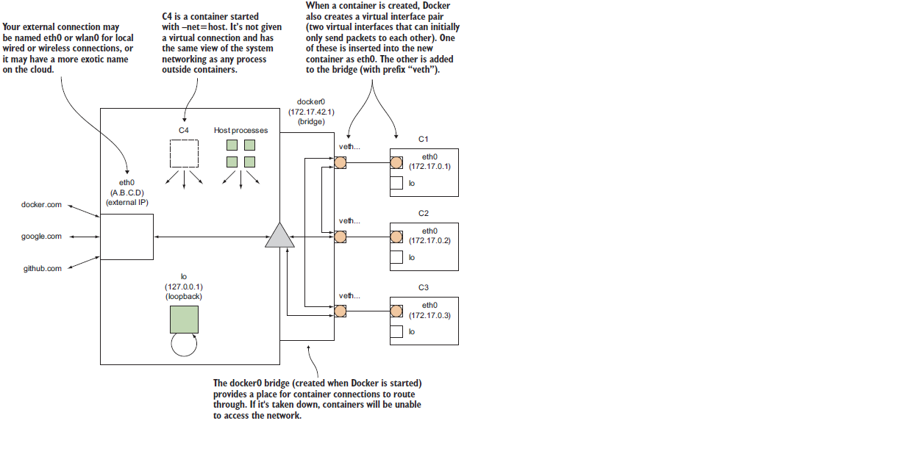

Some advanced topics on 《Manning Docker in Practice》

<!-- more -->

Docker Advanced Topics
=======================

### docker 虚拟网络

Docker 的虚拟网络配置如 

- Host 的 eth0 网络连接外网
- Host 的 docker0 网络是一个路由，让 docker 虚拟网络中的容器组成一个局域网
- Host 还有一个 loopback 网络 lo，对应 127.0.0.1
- 当容器创建，Docker daemon 会生成一对儿 veth 接口，一个布置在 Host 的 docker0 bridge 上，一个布置在容器的 eth0 上，互相通讯
- 容器还可以通过 --net=host 的方式启动，此时共享 Host 的网络设置，而不会创建虚拟网络

Host 宿主机上执行命令
```
$ ip route
default via 10.88.147.254 dev eth0         <-- 路由
10.88.147.0/24 dev eth0  proto kernel  scope link  src 10.88.147.128    <-- 网络和 Host 的外网 ip
169.254.0.0/16 dev eth0  scope link  metric 1003
172.17.0.0/16 dev docker0  proto kernel  scope link  src 172.17.0.1     <-- docker0 虚拟网络和 Host 在虚拟网络中的 ip
172.18.0.0/16 dev br-79f7b6f4f4e4  proto kernel  scope link  src 172.18.0.1    <-- docker network 启动的另一个虚拟网络

$ ip addr
1: lo: <LOOPBACK,UP,LOWER_UP> mtu 65536 qdisc noqueue state UNKNOWN
   inet 127.0.0.1/8 scope host lo        <-- lo 网络 ip: 127.0.0.1
2: eth0: <BROADCAST,MULTICAST,UP,LOWER_UP> mtu 1500 qdisc pfifo_fast state UP qlen 1000
   inet 10.88.147.128/24 brd 10.88.147.255 scope global eth1    <-- Host 外网 ip: 10.88.147.128
3: docker0: <BROADCAST,MULTICAST,UP,LOWER_UP> mtu 1500 qdisc noqueue state UP
   inet 172.17.0.1/16 scope global docker0                      <-- Host 在 Docker0 虚拟网络上的 ip: 172.17.0.1
4: br-79f7b6f4f4e4: <NO-CARRIER,BROADCAST,MULTICAST,UP> mtu 1500 qdisc noqueue state DOWN
   inet 172.18.0.1/16 scope global br-79f7b6f4f4e4              <-- Host 在另一个自定义虚拟网络上的 ip: 172.18.0.1
............
```

容器内执行命令
```
# ip addr
1: lo: <LOOPBACK,UP,LOWER_UP> mtu 65536 qdisc noqueue state UNKNOWN group default
   inet 127.0.0.1/8 scope host lo
6: eth0@if7: <BROADCAST,MULTICAST,UP,LOWER_UP> mtu 1500 qdisc noqueue state UP group default
   inet 172.17.0.2/16 scope global eth0              <-- 容器在 Docker 虚拟网络中的 ip

# ip route
default via 172.17.0.1 dev eth0          <-- 容器在 Docker 虚拟网络中的路由，看到就是宿主机在虚拟网络中的 ip
172.17.0.0/16 dev eth0  proto kernel  scope link  src 172.17.0.2    <-- 虚拟网络和容器在其中的 ip

# route -n
Kernel IP routing table
Destination     Gateway         Genmask         Flags Metric Ref    Use Iface
0.0.0.0         172.17.0.1      0.0.0.0         UG    0      0        0 eth0    <-- 网关就是宿主机在虚拟网络中的 ip
172.17.0.0      0.0.0.0         255.255.0.0     U     0      0        0 eth0
```

### 使用 Resolvable 搭建 DNS 实现容器间互联

前面知道，可以通过 docker run --link 或者 docker-compose 中的 link 来实现容器间访问，其本质是运行时修改 /etc/hosts

还有更好的方法么？我们知道容器其实运行在 Host 的 docker0 bridge 提供的虚拟网络上，可以在虚拟网络上创建一个 DNS

[Resolvable](https://github.com/gliderlabs/resolvable/) 可以读取容器信息，并提供 name to ip 的 DNS 服务

首先，在宿主机执行下面命令，获取 Host 的 docker0 bridge ip 和默认 DNS 配置
```
$ ip addr | grep 'inet.*docker0'
inet 172.17.42.1/16 scope global docker0
$ docker run --rm ubuntu:14.04.2 cat /etc/resolv.conf | grep nameserver
nameserver 8.8.8.8
nameserver 8.8.4.4
```

启动 Resolvable 容器提供 DNS 服务
```
$ DNSARGS="--dns 8.8.8.8 --dns 8.8.4.4"
$ PORTARGS="-p 172.17.42.1:53:53/udp"
$ VOLARGS="-v /var/run/docker.sock:/tmp/docker.sock"
$ docker run -d --name res -h resolvable $DNSARGS $PORTARGS $VOLARGS \
gliderlabs/resolvable:master
```
一些要点如下：

- --dns 选项将在容器内生成 /etc/resolv.conf 作为后备 DNS，当 Resolvable 服务无法识别给定的 name 时，就把请求转发给 /etc/resolv.conf 中的地址；这个选项在这里完全可以不写，因为选项的值和 Host 中的 /etc/resolv.conf 是完全一致的，而容器会默认继承 Host 中的 /etc/resolv.conf
- - -p 选项指定了端口转发，也就是说，指向 Host docker0 bridge 地址 53 端口的请求会转发到容器的 53 端口，并采用 udp 协议；这个端口用于监听 Resolvable 的 DNS 请求，将由 Resolvable 容器来提供服务
- - -v 选项把 docker socket 映射到容器中，使得 Resolvable 容器可以访问 Host 的 Docker Daemon
- - --name 和 -h 命令分别指定容器的 name 和 hostname；当 Resolvable 的 DNS 服务生效，Docker 虚拟网络中容器的 <name>.docker 和 <hostname> 都可以用来查询容器的 ip 地址

可以使用 dig (dnsutils on Ubuntu | bind-utils on CentOS) 来 check Resolvable 是否生效
```
# 向 Docker bridge0 也即 Host 的内网地址发请求，进而转发到 Resolvable 的 53 端口
$ dig +short @172.17.42.1 res.docker
172.17.0.22
$ dig +short @172.17.42.1 resolvable
172.17.0.22

$ docker run -it --dns 172.17.42.1 ubuntu:14.04.2 bash     # 启动新容器，dns 指向 docker0，其实会转发到 Resolvable
/# ping -q -c1 res.docker               # 看到，没有使用 link，Host 网络中的容器仍然可以相互可见和访问
...........
1 packets transmitted, 1 received, 0% packet loss, time 0ms
...........
/# ping -q -c1 www.google.com           # 这里将会使用 /etc/resolv.conf 中的地址
...........
1 packets transmitted, 1 received, 0% packet loss, time 0ms
...........
```

最后，配置好 Resolvable 之后，可以通过配置 Docker Daemon 选项的方法，配置 --bip=172.17.42.1/16 --dns=172.17.42.1

这样，之后再次 docker run 启动容器时，自动会生效上面两个选项，其中

- --bip=172.17.42.1/16 用于固定住 docker bridge0 网络路由的 ip，这样 Resolvable 启动中硬编码的 172.17.42.1 就不会失效
- - --dns=172.17.42.1 指定新启动的容器 dns 指向 172.17.42.1，这样 DNS 请求就会通过端口映射转发到 Resolvable 的 53 端口


