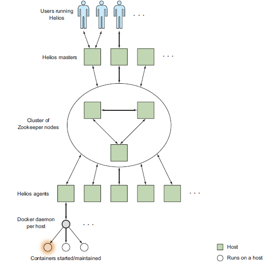
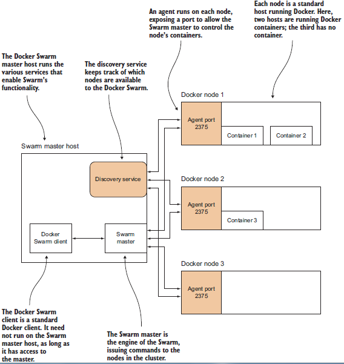

Some advanced topics on 《Manning Docker in Practice》

<!-- more -->

Docker Network
================

### docker 虚拟网络

Docker 的虚拟网络配置如 

- Host 的 eth0 网络连接外网
- Host 的 docker0 网络是一个路由，让 docker 虚拟网络中的容器组成一个局域网
- Host 还有一个 loopback 网络 lo，对应 127.0.0.1
- 当容器创建，Docker daemon 会生成一对儿 veth 接口，一个布置在 Host 的 docker0 bridge 上，一个布置在容器的 eth0 上，互相通讯
- 容器还可以通过 --net=host 的方式启动，此时共享 Host 的网络设置，而不会创建虚拟网络

Host 宿主机上执行命令
```
$ ip route
default via 10.88.147.254 dev eth0         <-- 路由
10.88.147.0/24 dev eth0  proto kernel  scope link  src 10.88.147.128    <-- 网络和 Host 的外网 ip
169.254.0.0/16 dev eth0  scope link  metric 1003
172.17.0.0/16 dev docker0  proto kernel  scope link  src 172.17.0.1     <-- docker0 虚拟网络和 Host 在虚拟网络中的 ip
172.18.0.0/16 dev br-79f7b6f4f4e4  proto kernel  scope link  src 172.18.0.1    <-- docker network 启动的另一个虚拟网络

$ ip addr
1: lo: <LOOPBACK,UP,LOWER_UP> mtu 65536 qdisc noqueue state UNKNOWN
   inet 127.0.0.1/8 scope host lo        <-- lo 网络 ip: 127.0.0.1
2: eth0: <BROADCAST,MULTICAST,UP,LOWER_UP> mtu 1500 qdisc pfifo_fast state UP qlen 1000
   inet 10.88.147.128/24 brd 10.88.147.255 scope global eth1    <-- Host 外网 ip: 10.88.147.128
3: docker0: <BROADCAST,MULTICAST,UP,LOWER_UP> mtu 1500 qdisc noqueue state UP
   inet 172.17.0.1/16 scope global docker0                      <-- Host 在 Docker0 虚拟网络上的 ip: 172.17.0.1
4: br-79f7b6f4f4e4: <NO-CARRIER,BROADCAST,MULTICAST,UP> mtu 1500 qdisc noqueue state DOWN
   inet 172.18.0.1/16 scope global br-79f7b6f4f4e4              <-- Host 在另一个自定义虚拟网络上的 ip: 172.18.0.1
............
```

容器内执行命令
```
# ip addr
1: lo: <LOOPBACK,UP,LOWER_UP> mtu 65536 qdisc noqueue state UNKNOWN group default
   inet 127.0.0.1/8 scope host lo
6: eth0@if7: <BROADCAST,MULTICAST,UP,LOWER_UP> mtu 1500 qdisc noqueue state UP group default
   inet 172.17.0.2/16 scope global eth0              <-- 容器在 Docker 虚拟网络中的 ip

# ip route
default via 172.17.0.1 dev eth0          <-- 容器在 Docker 虚拟网络中的路由，看到就是宿主机在虚拟网络中的 ip
172.17.0.0/16 dev eth0  proto kernel  scope link  src 172.17.0.2    <-- 虚拟网络和容器在其中的 ip

# route -n
Kernel IP routing table
Destination     Gateway         Genmask         Flags Metric Ref    Use Iface
0.0.0.0         172.17.0.1      0.0.0.0         UG    0      0        0 eth0    <-- 网关就是宿主机在虚拟网络中的 ip
172.17.0.0      0.0.0.0         255.255.0.0     U     0      0        0 eth0
```

### 使用 Resolvable 搭建 DNS 实现容器间互联

前面知道，可以通过 docker run --link 或者 docker-compose 中的 link 来实现容器间访问，其本质是运行时修改 /etc/hosts

还有更好的方法么？我们知道容器其实运行在 Host 的 docker0 bridge 提供的虚拟网络上，可以在虚拟网络上创建一个 DNS

[Resolvable](https://github.com/gliderlabs/resolvable/) 可以读取容器信息，并提供 name to ip 的 DNS 服务

首先，在宿主机执行下面命令，获取 Host 的 docker0 bridge ip 和默认 DNS 配置
```
$ ip addr | grep 'inet.*docker0'
inet 172.17.42.1/16 scope global docker0
$ docker run --rm ubuntu:14.04.2 cat /etc/resolv.conf | grep nameserver
nameserver 8.8.8.8
nameserver 8.8.4.4
```

启动 Resolvable 容器提供 DNS 服务
```
$ DNSARGS="--dns 8.8.8.8 --dns 8.8.4.4"
$ PORTARGS="-p 172.17.42.1:53:53/udp"
$ VOLARGS="-v /var/run/docker.sock:/tmp/docker.sock"
$ docker run -d --name res -h resolvable $DNSARGS $PORTARGS $VOLARGS \
gliderlabs/resolvable:master
```
一些要点如下：

- --dns 选项将在容器内生成 /etc/resolv.conf 作为后备 DNS，当 Resolvable 服务无法识别给定的 name 时，就把请求转发给 /etc/resolv.conf 中的地址；这个选项在这里完全可以不写，因为选项的值和 Host 中的 /etc/resolv.conf 是完全一致的，而容器会默认继承 Host 中的 /etc/resolv.conf
- - -p 选项指定了端口转发，也就是说，指向 Host docker0 bridge 地址 53 端口的请求会转发到容器的 53 端口，并采用 udp 协议；这个端口用于监听 Resolvable 的 DNS 请求，将由 Resolvable 容器来提供服务
- - -v 选项把 docker socket 映射到容器中，使得 Resolvable 容器可以访问 Host 的 Docker Daemon
- - --name 和 -h 命令分别指定容器的 name 和 hostname；当 Resolvable 的 DNS 服务生效，Docker 虚拟网络中容器的 \<name\>.docker 和 \<hostname\> 都可以用来查询容器的 ip 地址

可以使用 dig (dnsutils on Ubuntu | bind-utils on CentOS) 来 check Resolvable 是否生效
```
# 向 Docker bridge0 也即 Host 的内网地址发请求，进而转发到 Resolvable 的 53 端口
$ dig +short @172.17.42.1 res.docker
172.17.0.22
$ dig +short @172.17.42.1 resolvable
172.17.0.22

$ docker run -it --dns 172.17.42.1 ubuntu:14.04.2 bash     # 启动新容器，dns 指向 docker0，其实会转发到 Resolvable
/# ping -q -c1 res.docker               # 看到，没有使用 link，Host 网络中的容器仍然可以相互可见和访问
...........
1 packets transmitted, 1 received, 0% packet loss, time 0ms
...........
/# ping -q -c1 www.google.com           # 这里将会使用 /etc/resolv.conf 中的地址
...........
1 packets transmitted, 1 received, 0% packet loss, time 0ms
...........
```

最后，配置好 Resolvable 之后，可以通过配置 Docker Daemon 选项的方法，配置 --bip=172.17.42.1/16 --dns=172.17.42.1

这样，之后再次 docker run 启动容器时，自动会生效上面两个选项，其中

- --bip=172.17.42.1/16 用于固定住 docker bridge0 网络路由的 ip，这样 Resolvable 启动中硬编码的 172.17.42.1 就不会失效
- - --dns=172.17.42.1 指定新启动的容器 dns 指向 172.17.42.1，这样 DNS 请求就会通过端口映射转发到 Resolvable 的 53 端口


### 使用 Weave 实现跨宿主机的容器间通讯

单宿主机上的容器都在 docker0 bridge 局域网中，上一节使用 Resolvable 在这个局域网中创建 DNS 服务，实现容器间相互通讯。

多宿主机上的容器显然各自在其宿主机的局域网中，无法互联，也无法使用 Resolvable，那么有办法实现相互通讯么？

答案是肯定的，使用 Weave 搭建一条虚拟局域网(Weave network)，并实现容器间使用 ip 相互通讯。

[Weave](https://github.com/zettio/weave) 是一个二进制文件，要在每个需要互联的宿主机上安装一份
```
$ sudo wget -O /usr/local/bin/weave https://github.com/zettio/weave/releases/download/latest_release/weave
$ sudo chmod +x /usr/local/bin/weave
```

下面，比如要让 host1 & host2 两个宿主机的容器间互联，这两个宿主机本身必须是可以通过 ip 互联的

在宿主机 host1 上执行
```
host1$ curl http://ip-addr.es       # 通过 curl ip-addr.es 来返回宿主机的 ip 地址
1.2.3.4
host1$ sudo weave launch            # 使用 sudo 启动 Weave 服务
host1$ C=$(sudo weave run 10.0.1.1/24 -t -i ubuntu)      # 通过 weave 而不是通过 docker run 来启动容器，并设置虚拟局域网上容器的 ip
```

在宿主机 host2 上执行
```
host2$ curl http://ip-addr.es       # 同样，获取 host2 的 ip
1.2.3.5
host2# sudo weave launch 1.2.3.4    # sudo 启动 Weave 并指定 host1 ip，以 attach 到 host1 的 Weave 服务所创建的虚拟局域网中
host2# C=$(sudo weave run 10.0.1.2/24 -t -i ubuntu)      # 同样通过 weave 启动容器，并设置虚拟局域网内容器的 ip
```

OK，现在两个容器可以相互通讯了，比如在 host1 上，
```
host1# docker attach $C
root@28841bd02eff:/# ping -c 1 -q 10.0.1.2
PING 10.0.1.2 (10.0.1.2): 48 data bytes
--- 10.0.1.2 ping statistics ---
1 packets transmitted, 1 packets received, 0% packet loss    # 成功 ping 到 host2 上的容器
```


Docker Orchestration
=======================

### 单宿主机上使用 Systemd 进行编排

Docker 本身提供 docker-compose 工具，可以定义单宿主机上容器的配置以及协调容器间的依赖关系。这个工具在 Docker 容器级别上非常好用，但是无法对宿主机非 Docker 领域的资源做管理。

Systemd 有些类似 Supervisord，是对宿主机服务级别的管理工具，可以在更高的层面上，对容器进行管理和编排。下面以 SQLite + socat 代理为例，看看 systemd 和 docker-compose 的区别

Systemd 使用 ini 格式的配置文件，下面先看看 SQLite server 容器的配置：/etc/systemd/system/sqliteserver.service
```
[Unit]
Description=SQLite Docker Server
After=docker.service        # 依赖 docker 服务
Requires=docker.service

[Service]
Restart=always              # 自动重启
ExecStartPre=-/bin/touch /tmp/sqlitedbs/test      # 启动前准备好宿主机上的数据库目录
ExecStartPre=-/bin/touch /tmp/sqlitedbs/live
ExecStartPre=/bin/bash -c '/usr/bin/docker kill sqliteserver || /bin/true'    # 启动前先清理历史服务
ExecStartPre=/bin/bash -c '/usr/bin/docker rm -f sqliteserver || /bin/true'
ExecStartPre=/usr/bin/docker pull dockerinpractice/docker-compose-sqlite      # 启动前先 pull 镜像
ExecStart=/usr/bin/docker run --name sqliteserver \         # 启动命令，就是一条 docker run
-v /tmp/sqlitedbs/test:/opt/sqlite/db \
dockerinpractice/docker-compose-sqlite /bin/bash -c \
'socat TCP-L:12345,fork,reuseaddr \
EXEC:"sqlite3 /opt/sqlite/db",pty'
ExecStop=/usr/bin/docker rm -f sqliteserver                 # 服务终止命令，删除容器

[Install]
WantedBy=multi-user.target                        # 系统启动后的服务自动运行命令，后面会看到这条命令如何生效
```

然后是 socat 代理容器的配置：/etc/systemd/system/sqliteproxy.service
```
[Unit]
Description=SQLite Docker Proxy
After=sqliteserver.service           # 依赖 sqliteserver 服务，故此间接依赖 docker 服务
Requires=sqliteserver.service

[Service]
Restart=always                       # 自动重启
ExecStartPre=/bin/bash -c '/usr/bin/docker kill sqliteproxy || /bin/true'    # 类似的启动前清理历史及 pull 镜像
ExecStartPre=/bin/bash -c '/usr/bin/docker rm -f sqliteproxy || /bin/true'
ExecStartPre=/usr/bin/docker pull dockerinpractice/docker-compose-sqlite
ExecStart=/usr/bin/docker run --name sqliteproxy \                           # 启动命令
-p 12346:12346 --link sqliteserver:sqliteserver \
dockerinpractice/docker-compose-sqlite /bin/bash \
-c 'socat TCP-L:12346,fork,reuseaddr TCP:sqliteserver:12345'
ExecStop=/usr/bin/docker rm -f sqliteproxy                                   # 服务终止清理命令

[Install]
WantedBy=multi-user.target                                                   # 系统启动后服务自动运行设置
```

接下来服务 enable 以及启动后自动运行的配置
```
$ sudo systemctl enable /etc/systemd/system/sqliteserver.service
ln -s '/etc/systemd/system/sqliteserver.service' \
'/etc/systemd/system/multi-user.target.wants/sqliteserver.service'

$ sudo systemctl enable /etc/systemd/system/sqliteproxy.service
ln -s '/etc/systemd/system/sqliteproxy.service' \
'/etc/systemd/system/multi-user.target.wants/sqliteproxy.service'
```
把容器服务 link 到 /etc/systemd/system/multi-user.target.wants/，系统重启进入 multi-user stage 时就会自动启动服务

运行服务
```
$ sudo systemctl start sqliteproxy
```
由于 Systemd 配置了依赖关系，故此这里只要运行 sqliteproxy，那么它所依赖的服务都会自动启动

到这里，我们看看 Systemd 和 docker-compose，它们的共同点是都定义了容器间的依赖关系，但是他们的区别是显而易见的

- docker-compose 着眼于容器自身的配置，比如 link、volume、entrypoint 等等；而这些对于 systemd 来说，只是一条启动命令而已，由使用者自己搞定
- Systemd 则着眼于容器和宿主机之间的联系，比如准备运行环境、启动前中后期宿主所要担负的职责等，是从宿主的角度来编排和配置容器的运行

这样看来，我们可以在 systemd 的启动命令部分，直接使用 docker-compose，这样就不需要定义两个服务了，只要一个服务启动两个容器即可

### 多宿主机上使用 Helios 手动 Docker 编排

Helios 是 Spotify 公司开发的 Docker 多宿主编排工具，以手动的方式控制容器具体部署到哪个宿主。出于简单考虑，本部分的例子仍然在单宿主机上运行，不过会指出如何扩展到多宿主的情况。

Helios 的架构如 

具体来说，Helios 由 Masters / ZooKeeper / Agents 组成；Masters 本身也可以是集群，避免单点故障造成可用性损失。Masters 和 Agents 都注册在 Zookeeper 上，由 ZooKeeper 维护集群节点以及部署任务信息；用户向 Master 发送部署 jobs，然后手动指定 jobs 所部属的 Agents 节点。

部署ZooKeeper，注意 ZooKeeper 本身也可以是集群，而本例中只是部署在一个节点而已
```
$ docker run --name zookeeper -d jplock/zookeeper:3.4.6
$ docker inspect -f '{{.NetworkSettings.IPAddress}}' zookeeper
172.17.0.9                 # 记住 ZooKeeper 所部署的位置
```

部署 Helios Master，这里部署在同一个宿主的另一个容器上
```
$ IMG=dockerinpractice/docker-helios
$ docker run -d --name hmaster $IMG helios-master --zk 172.17.0.9         # helios-master 命令，指定 ZooKeeper 的位置
$ docker inspect -f '{{.NetworkSettings.IPAddress}}' hmaster
172.17.0.11                    # 记住 Master 的位置
```

通过 ZooKeeper Client 查看 ZK 集群中的配置信息
```
$ docker exec -it zookeeper bin/zkCli.sh
[zk: localhost:2181(CONNECTED) 0] ls /
[history, config, status, zookeeper]             # 看到，除了默认的 zookeeper 目录之外，Helios Master 创建了另外 3 个目录
[zk: localhost:2181(CONNECTED) 2] ls /status/masters
[896bc963d899]                                   # /status/masters 记录了 Master 的容器 id
[zk: localhost:2181(CONNECTED) 3] ls /status/hosts
[]                                               # 还没有 Agent Hosts
```

部署 Helios Agents，同样部署在同一个宿主上
```
$ docker run -v /var/run/docker.sock:/var/run/docker.sock -d --name hagent \       # 由于 Agents 要负责启动容器，故此，必须能调用 Docker
dockerinpractice/docker-helios helios-agent --zk 172.17.0.9                        # 同样要指定 ZooKeeper 位置，由 ZK 统一管理
$ docker inspect -f '{{.NetworkSettings.IPAddress}}' hagent
172.17.0.12                                                                        # 记住 Agent 的位置
```

再次查看 ZK 中的配置
```
[zk: localhost:2181(CONNECTED) 4] ls /status/hosts
[5a4abcb27107]                       # 已经有了 Agent Host
[zk: localhost:2181(CONNECTED) 5] ls /status/hosts/5a4abcb27107
[agentinfo, jobs, environment, hostinfo, up]       # 这个Host 也配置了一些必要的目录
[zk: localhost:2181(CONNECTED) 6] get /status/hosts/5a4abcb27107/agentinfo
{"inputArguments":["-Dcom.sun.management.jmxremote.port=9203", [...]
[...]
```

Helios 环境搭建完毕！下面要做的是，如何使用 Helios 集群来部署和编排容器了！

首先，创建 Helios Client 的快捷方式
```
$ alias helios="docker run -i --rm dockerinpractice/docker-helios \      # 命令会启动 Helios 容器，执行 helios 命令；命令完成后自动退出
helios -z http://172.17.0.11:5801"                                       # 命令参数需要制定 Helios Masters 的位置
```

然后创建部署任务，注意这里不指定部署的位置，所做的只是定义一下任务
```
$ helios create -p nc=8080:8080 netcat:v1 ubuntu:14.04.2 -- \    # 任务名字 netcat:v1，指定镜像，分配端口
sh -c 'echo hello | nc -l 8080'                                  # 容器启动后执行的命令
$ helios jobs
JOB ID NAME VERSION HOSTS COMMAND ENVIRONMENT
netcat:v1:2067d43 netcat v1 0 sh -c "echo hello | nc -l 8080"
```

开始部署
```
$ helios deploy netcat:v1 5a4abcb27107           # 指定 Agent Host 的容器 ID，表示在该 Host 上部署 netcat 任务；是手动的静态部署！
$ helios status
JOB ID HOST GOAL STATE CONTAINER ID PORTS
netcat:v1:2067d43 5a4abcb27107.START RUNNING b1225bc nc=8080:8080
```

最后，任务结束后的清理工作
```
$ helios undeploy -a --yes netcat:v1
$ helios remove --yes netcat:v1
```

最后讨论一下 Helios 的集群搭建问题，有几种方式

- 最直接的肯定是在多宿主上直接搭建
- 其次，也可以在多宿主上，每个宿主上启动一个容器来搭建；此时，完全可以通过端口映射(Masters 5801/5802; Agents 5803/5804)，把对宿主地址的请求转发到容器之中；同时，启动容器时也要指定 --name $(hostname -f)，可以通过宿主机名字来请求；同样，Agents 容器启动时也要通过 -v 来 link 宿主机的 docker socket
- 最后，本例中在单宿主上启动多个容器来搭建的方式，由于都在 bridge0 局域网中，故此采用了 ip 来访问

### Swarm 多宿主编排

Swarm 是 Docker 提供的编排工具，和 Helios 手动配置容器部署位置的特性不同，Swarm 让集群自行控制容器部署的位置，隐藏集群中 hosts 的信息，让用户使用 Swarm 进行多宿主编排时，和在单机上使用 Docker 管理容器一样方便。

Swarm 也包括 Master、Discovery Service 和 Agents，如 

- 和 Helios 不同，Swarm 通常使用单个 Master，也可以查看 docker swarm 文档查看部署多 Masters 的方法
- Swarm Master 启动后通过 discovery service 获取集群宿主节点信息，以便发布部署命令
- Swarm 可以灵活选用多种服务发现方式和框架，不拘泥于 ZooKeeper。Docker 还给 Swarm 提供了一个基于 token 的 discovery service，后面例子中会用到
- Agents 运行在 Swarm 集群的各个宿主机上，报告宿主机的连接信息给 discovery service，并接收部署任务运行容器。为了运行容器，集群的宿主机必须运行 Docker Daemon，并要暴露在外部的端口(默认 2375)上，方法是 -H ${ip:port}，这样 Master 就可以远程控制该节点的容器了
- 类似 Helios，Swarm 也有一个 client 命令程序，同样不是必须运行在 Master 上，只要能正常连接 Master 即可

举个完整流程的例子

为使用 discovery service 生成 token
```
h1 $ docker pull swarm
h1 $ docker run swarm create           # 创建 token，作为 cluster id
126400c309dbd1405cd7218ed3f1a25e
h1 $ CLUSTER_ID=126400c309dbd1405cd7218ed3f1a25e
```

此时可以查看 Swarm 集群的宿主列表了。当然，此时并没有宿主
```
h1 $ docker run swarm list token://$CLUSTER_ID
h1 $ curl https://discovery-stage.hub.docker.com/v1/clusters/$CLUSTER_ID
[]
```

在 h1 上启动 Agent 容器
```
h1 $ ip addr show eth0 | grep 'inet '      # 宿主 h1 的 ip
inet 10.194.12.221/20 brd 10.194.15.255 scope global eth0

h1 $ docker run -d swarm join --addr=10.194.12.221:2375 token://$CLUSTER_ID   # join 命令要指定本宿主的 ip ，以及待 join 集群的 id(token)
9bf2db849bac7b33201d6d258187bd14132b74909c72912e5f135b3a4a7f4e51 
h1 $ docker run swarm list token://$CLUSTER_ID
10.194.12.221:2375          # 此时，list 命令可以看到新宿主了；另外，看到 discovery service 记录宿主的 ip 和端口
h1 $ curl https://discovery-stage.hub.docker.com/v1/clusters/$CLUSTER_ID
["10.194.12.221:2375"]      # 也可以使用 https 来获取宿主列表
```

同样在 h1 上启动 master 容器
```
h1 $ docker run -d -p 4000:2375 swarm manage token://$CLUSTER_ID    # 指定集群 id；由于 2375 端口已经被 agent 用了，故此映射到 4000 上
04227ba0c472000bafac8499e2b67b5f0629a80615bb8c2691c6ceda242a1dd0
```

此时可以查看 Swarm 集群的信息了，因为有 Master 了！
```
h1 $ docker -H tcp://localhost:4000 info     # 看到 -H 选项，另外访问 4000 端口，也就是向 Master 的 Docker Daemon 请求
Containers: 2
Strategy: spread                 # 这个是任务在多个宿主机上分配的策略
Filters: affinity, health, constraint, port, dependency    # 这个是筛选宿主的过滤器
Nodes: 1                         # 一个宿主节点
h1: 10.194.12.221:2375
? Containers: 2                  # 两个容器，一个是 Agent 一个是 Master
```

集群中加入一个全新的宿主机，方法是在该宿主机上也启动 Agent 容器，并连接 cluster id
```
h2 $ docker run -d swarm join --addr=10.194.8.7:2375 token://$CLUSTER_ID
h2 $ docker -H tcp://10.194.12.221:4000 info       # 再次向 Master 请求集群信息
Containers: 3         # 共 3 个容器
Strategy: spread
Filters: affinity, health, constraint, port, dependency
Nodes: 2              # 共 2 个宿主
h2: 10.194.8.7:2375
? Containers: 1       # 宿主 h2 上一个容器 (Agent)
h1: 10.194.12.221:2375
? Containers: 2       # 宿主 h1 上一个容器 (Master / Agent)
```

最后看看如何部署容器
```
h2 $ docker -H tcp://10.194.12.221:4000 run -d ubuntu:14.04.2 sleep 60     # 仍然向 Master 发请求，不需要在 Master 上，只要能连接 Master 即可
0747c14774c70bad00bd7e2bcbf583d756ffe6d61459ca920887894b33734d3a

h2 $ docker -H tcp://localhost:4000 ps      # 同样，向 Master 请求 docker ps
CONTAINER ID IMAGE COMMAND CREATED STATUS PORTS NAMES
0747c14774c7 ubuntu:14.04 sleep 60 19 seconds ago Up Less than a second h1/serene_poitras

h2 $ docker -H tcp://10.194.12.221:4000 info | grep Containers
Containers: 4
? Containers: 1
? Containers: 3     # 新容器被部署在 h1 上，虽然是从 h2 上发起的请求
```

如何删除集群呢？向 discovery service 发起请求
```
h1 $ curl -X DELETE https://discovery.hub.docker.com/v1/clusters/$CLUSTER_ID
```

我们看到

- Swarm 集群自己控制容器部署的位置
- Swarm Client 只要能够连接 Master，就可以像单机一样执行 Docker 命令，比如 docker info/ docker ps/ docker run，只是加了个 -H 选项而已
- 本例中，Master/Agent 都是在宿主机上通过 Docker 容器创建的，为了让 Client 能连接 Master，也为了让 Master 控制宿主 Agent 启动容器，Master 和 Agent 所在宿主的 Docker Daemon 都要通过 -H ${ip:port} 的方式启动
- Master 和 Agent 都把服务对应的端口映射到了宿主机的外部端口上，这样，相互间的交互并不是通过 Docker 内部的虚拟局域网进行的 (因为要跨宿主机通讯，docker 虚拟局域网满足不了这个需求)，而是通过向各自宿主的端口发送 docker 命令来实现通讯的
